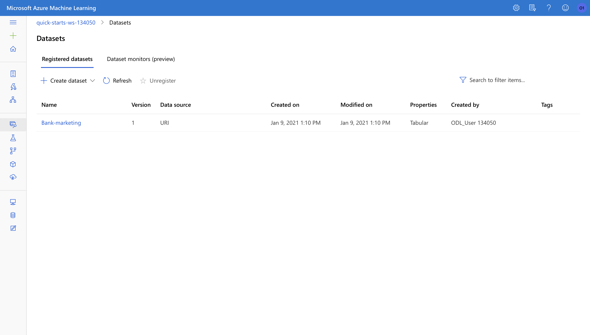
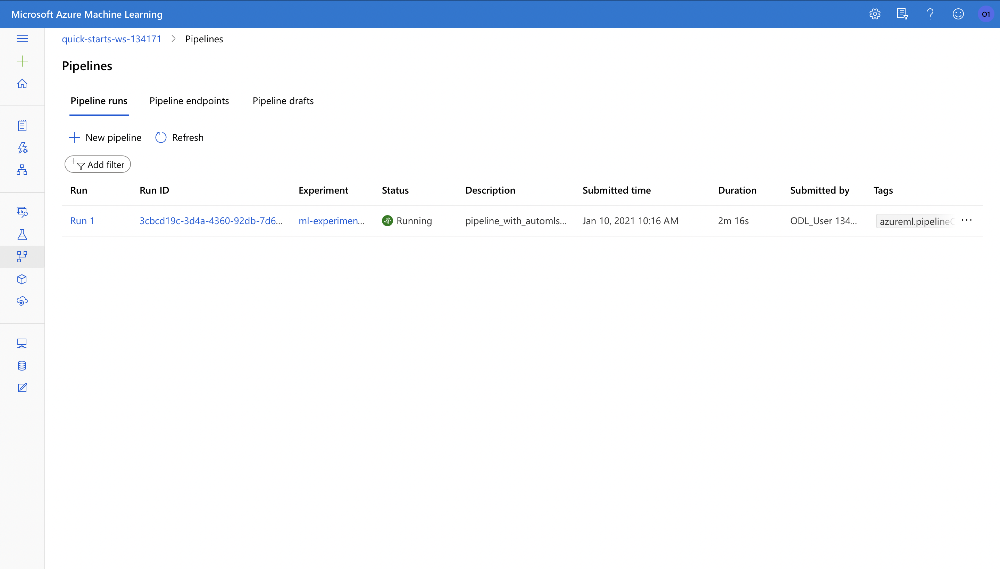

# Operationalizing Machine Learning

This project uses Azure to configure, deploy and consume a cloud-based machine learning production model.

## Architectural Diagram

## Key Steps
### Create an AutoML experiment to retrieve the best classifier. 
This step should be implemented through Microsoft Azure Machine Learning Studio (ML Studio). The user will:
1. Create a new Automated ML run.
2. Select and upload the Bankmarketing dataset. *Registered Datasets* in ML Studio shows that Bankmarketing datasets is available.

3. Create a new Automated ML experiment.
4. Configure a new compute cluster (Virtual Machine Size: `Standard_DS12_v2`, Minimum number of nodes: `1`, Maximum number of nodes: `75` or as large as the quota allows)
5. Run the experiment using *Classification*, ensure *Explain best model* is checked. On *Exit criterion*, reduce the *Concurrency* from default to `75`(in my case) (this number should always be less than the number of the compute cluster). Note: This process takes about 20 minutes.
6. Wait until the experiment is shown as complete.

7. The best model is a "VotingEnsemble" and it has achieved an accuracy of 0.92079.

### Deploy the best model
1. Select the best model for deployment
2. Deploy the model and enable *Authentication*
3. Deploy the model using *Azure Container Instance* (ACI)
### Enable Application Insights using Azure SDK for Python
1. Ensure `az` is installed, as well as the Python SDK for Azure.
2. Create a new virtual environment with Python 3. Ensure `azureml-sdk` is installed. You may also want to have `pandas`, `NumPy`, `scikit-learn` and `Matplotlib` installed if you want to run all scripts on your local machine.
3. Download the configuration file to the current directory.
4. Set the deployment name to that you set in "Deployment the best model" step.
5. Run `python logs.py` in the virtual environment. The output is shown below.

6. Check to make sure that Application Insights has been enabled in the Details tab of the endpoint.

### Consume model endpoint
#### Via Swagger URI
1. Download the swagger.json file.
2. Run the `swagger.sh` and `serve.py`.
3. Interact with the swagger instance running with the documentation for the HTTP API of the model.
4. The contents of the API for the model is:

5. Swagger is now running on the localhost.

#### Via REST URI
1. Modify both the `scoring_uri` and the `key` to match the key for your service and the URI that was generated after deployment.
2. Execute the `endpoint.py` file, the output should be similar to the following:

### Create, publish and consume a pipeline
1. Update `experiment_name` to match the name of your existing experiment in `aml-pipelines-with-automated-machine-learning-step.ipynb`.
2. Upload `aml-pipelines-with-automated-machine-learning-step.ipynb` to the Azure ML Studio.
3. Update all the variables that are noted to match your environment.
4. Run through the cells.
5. Verify the pipeline has been created and shown in Azure ML Studio, in the *Pipelines* section.

6. Verify that the Pipeline Endpoint is shown in the pipeline section in Azure ML Studio.

7. Verify that the Bankmarketing dataset is with the AutoML module.

8. Verify that the "Published pipeline overview" shows a REST endpoint and a status of Active.

9. Verify that in Jupyter Notebook, the "Use RunDetails Widget" shows the step runs.

10. Verify that the pipeline run in Azure ML Studio has completed.

## Screen Recording
There is a video [link](https://youtu.be/7Jh9LikExjk) to the demonstration above.